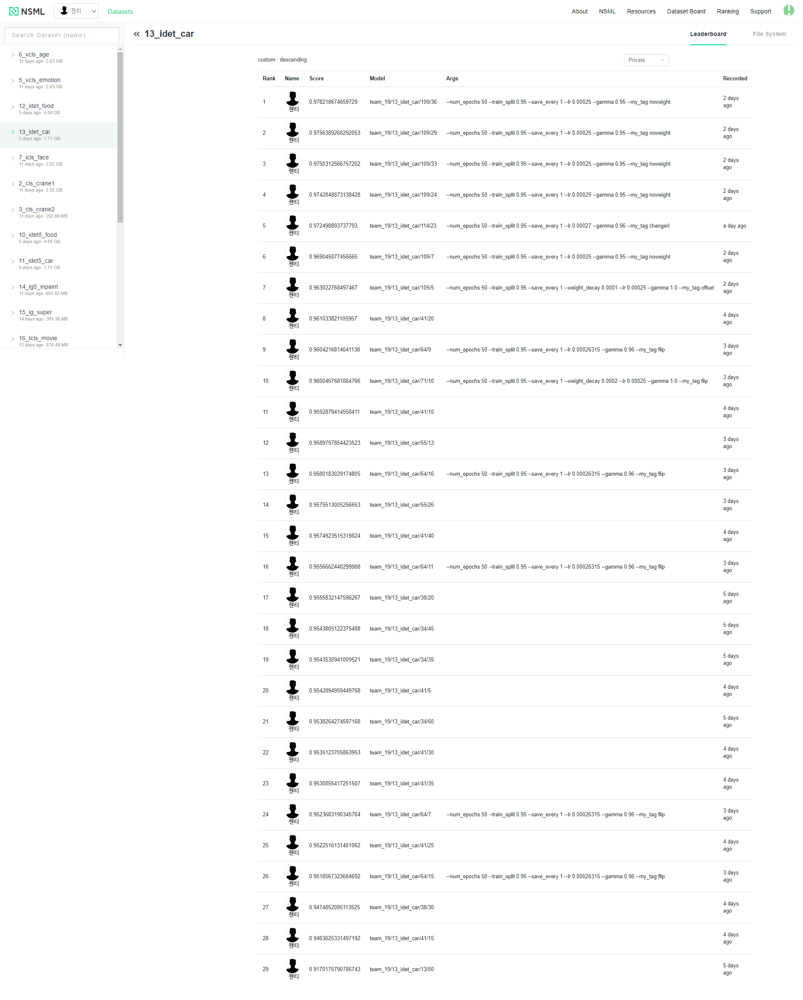

### Team Jenti's solution for AI_Starthon2019
#### Winnning Submission of for   [Problem 13](https://github.com/ai-starthon/AI_Starthon2019/tree/master/13_idet_car_baseline)
* code:  ./team_19_13_idet_car_13_idet_car_109
* base model: CornerNet ( https://github.com/princeton-vl/CornerNet-Lite )
* We applied CornerNet & CornerNet-Squeeze models to the problem without tag Loss term. 

| Class in source code  | IOU socre | Base Model | Details |
|:--------:|:--------:|--------:|--------:|
| CornerOffset  | 97.8 | CornerNet | random flip, with offset Loss   |
| CornerSimple| 96.1 | CornerNet | add random flip, without  offset Loss |
| CornerSimple | 95 | CornerNet | without offset Loss |
| CornerSqueezeSimple | 91 | CornerNet-Squeeze |  without offset Loss |

#### Our submission records for Problem 13

### References
* https://github.com/princeton-vl/CornerNet-Lite
